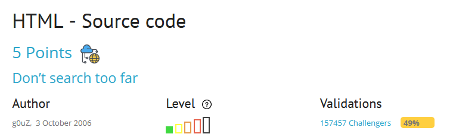
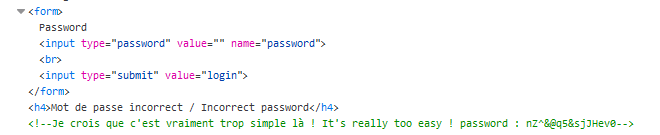
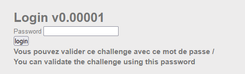

### HTML SOURCE CODE
Bài lab này yêu cầu nhập một mật khẩu đúng để có thể giải quyết. Với tên của bài là "HTML Source Code", ta thử xem source code HTML của trang web, nhìn qua một lượt thấy phần comment trong mã HTML có chứa một mật khẩu:

Thử sử dụng mật khẩu đó để nhập và submit thì thành công và lấy được flag của bài lab chính là mật khẩu đó.

#### Flag: nZ^&@q5&sjJHev0
#### Giải thích
Khi lập trình một trang web, các nhà phát triển có thể đặt các comment chứa thông tin nhạy cảm ví dụ như thông tin xác thực để tiện làm việc với hệ thống, khi hoàn thành trang web các nhà phát triển có thể quên xóa đi các thông tin nhạy cảm đó dẫn đến bị lộ.