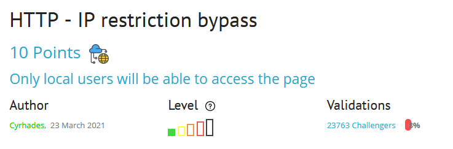
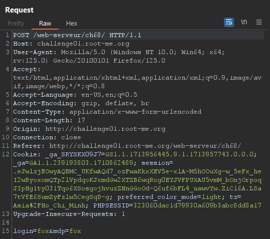
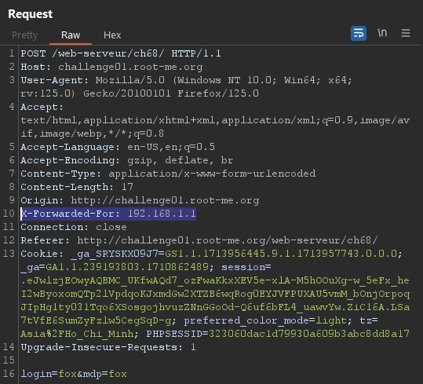
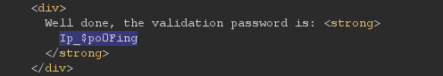

### HTTP IP RESTRICTION BYPASS
* Mô tả: "Dear colleagues, We’re now managing connections to the intranet using private IP addresses, so it’s no longer necessary to login with a username / password when you are already connected to the internal company network" - "Các đồng nghiệp thân mến,  Chúng tôi hiện đang quản lý các kết nối với mạng nội bộ bằng địa chỉ IP riêng, do đó không cần thiết phải đăng nhập bằng tên người dùng / mật khẩu khi bạn đã kết nối với mạng nội bộ của công ty".
* Gợi ý: "Only local users will be able to access the page" - "Chỉ người dùng cục bộ mới có thể truy cập trang".

#### Solution
Okay, khi bắt đầu bài lab cho ta một form đăng nhập và thông báo " You should authenticate because you're not on the LAN - Bạn nên xác thực vì bạn không ở trong mạng LAN".
Theo như tên đề bài và mô tả thì có vẻ như chúng ta không cần xác thực bằng username và password, để hệ thống xác thực bạn thì bạn phải là người dùng cục bộ (nghĩa là nằm trong mạng LAN) mà nằm trong mạng LAN thì IP của bạn phải thuộc dải IP của mạng LAN đó và tất nhiên khi bắt đầu bài lab thì không có chuyện đó xảy ra.
Mạng LAN thưởng sử dụng các dải địa chỉ IP private là: 10.0.0.0/8 đến 10.255.255.255/8, 172.16.0.0/12 đến 172.31.255.255/12, 192.168.0.0/16 đến 192.168.255.255/16.

Để giải quyết bài lab này ta cần thực hiện gán cho bản thân địa chỉ IP private nào đó, khi đó hệ thống nhận diện đó là IP cục bộ và việc xác thực sẽ thành công.
Trong môi trường web, để có thể gửi thông tin về địa chỉ IP, thường sử dụng Header "X-Forwarded-For", header có ý nghĩa cho biết giá trị theo sau là địa chỉ IP của máy gửi yêu cầu.
Việc cần làm là thực hiện thêm header "X-Forwarded-For" với giá trị là một IP cục bộ, Ví dụ "X-Forwarded-For: 192.168.1.1".

Sử dụng BurpSuite bắt yêu cầu xác thực:

Thêm header "X-Forwarded-For: 192.168.1.1":

Kết quả trả về:

Như vậy ta đã giả mạo thành một người dùng cục bộ và được hệ thống xác nhận.
#### Flag: Ip_$po0Fing
#### Giải thích
Đôi khi hệ thống web cho phép các người dùng cục bộ (trong mạng LAN) có thể truy cập các chức năng yêu cầu đặc quyền mà không cần xác thực vì họ tin tưởng các người dùng cục bộ. Khi kiểm thử một trang web hãy thử để IP thành địa chỉ IP cục bộ xem có gì xảy ra không nhé!!!
