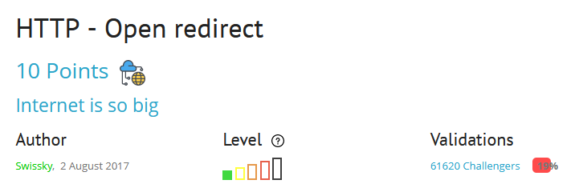
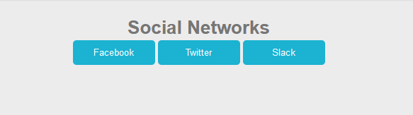
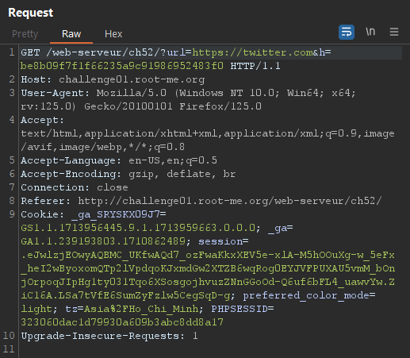
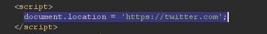
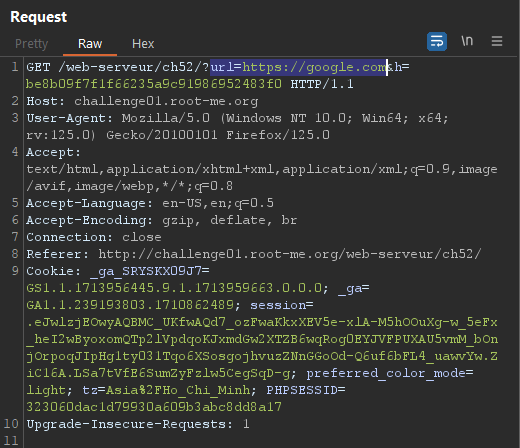
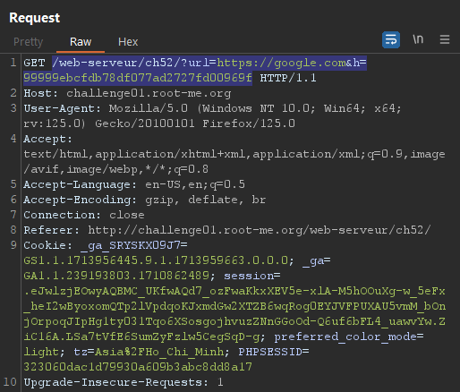
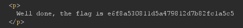

### HTTP OPEN REDIRECT
* Mô tả: "Find a way to make a redirection to a domain other than those showed on the web page" - "Tìm cách thực hiện chuyển hướng đến một tên miền khác với những tên miền được hiển thị trên trang web"
* Gợi ý: 
#### Solution
Khi bắt đầu bài lab, trang web cho ta 3 sự lựa chọn để chuyển hướng đến các trang tương ứng:

Bắt yêu cầu trong BurpSuite ta thấy rằng khi nhấp vào 1 trong 3 nút thì một yêu cầu gửi đến server có đường dẫn dạng "/web-serveur/ch52/?url=https://twitter.com&h=be8b09f7f1f66235a9c91986952483f0":

Tuy phản hồi không có mã trạng thái "302 - Redirect" nhưng quan sát trong nội dung trả về ta thấy có đoạn JavaScript như sau:

Khi trình duyệt xử lí nội dung trả về thì đoạn mã "document.location = 'https://twitter.com';" được thực thi và đây chính là mã JavaScript giúp chuyển hướng đến trang web khác.
Để giải quyết bài lab thì ta phải buộc trình duyệt chuyển hướng đến các trang web khác ngoài 3 trang web được cho sẵn, và để thực hiện điều đó ta thay đổi giá trị của tham số "url" trong yêu cầu, ví dụ chuyển hướng sang google.com:

Nhưng tuy nhiên, sau khi gửi yêu cầu thì bài lab vẫn chưa được giải quyết và một thông báo "Incorect hash" được trả về, vậy lí do là gì? Ta có thể thấy ngoài tham, số "url" còn có một tham số "h", có vẻ như đây là một giá trị băm nhưng là giá trị băm của cái gì? 
Thử băm thông điệp "https://google.com" bằng hàm băm MD5 và thu được giá trị băm "99999ebcfdb78df077ad2727fd00969f" sau đó thay cho giá trị của tham số "h"
Bây giờ đường dẫn của yêu cầu sẽ như sau:

Và bummm, sau khi gửi yêu cầu và xem xét trong nội dung phản hồi thì ta nhận được thông báo hoàn thành bài lab kèm flag.

#### Giải thích
Chuyển hướng mở xảy ra khi các trang web cho phép chuyển hướng đến các trang khác, nhưng nếu không xác thực trang sẽ chuyển hướng đến xem liệu rằng có an toàn hay không thì việc kẻ tấn công buộc trang web chuyển hướng đến các trang độc hại và gây hại cho người dùng là hoàn toàn có thể. Ví dụ như ở trên, ta thay đổi giá trị của tham số "url" thành "http://attacker.net" thay vì "https://google.com" thì người dùng hoàn toàn có thể bị lừa và tiết lộ những thông tin nhạy cảm.